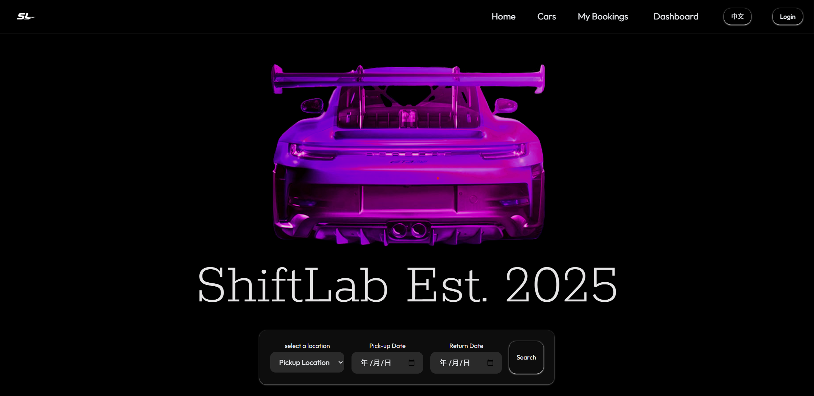
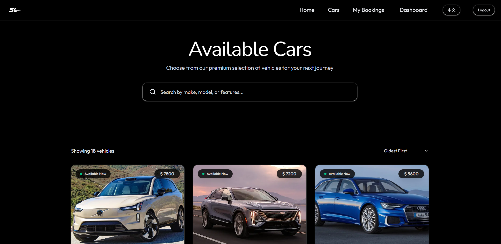
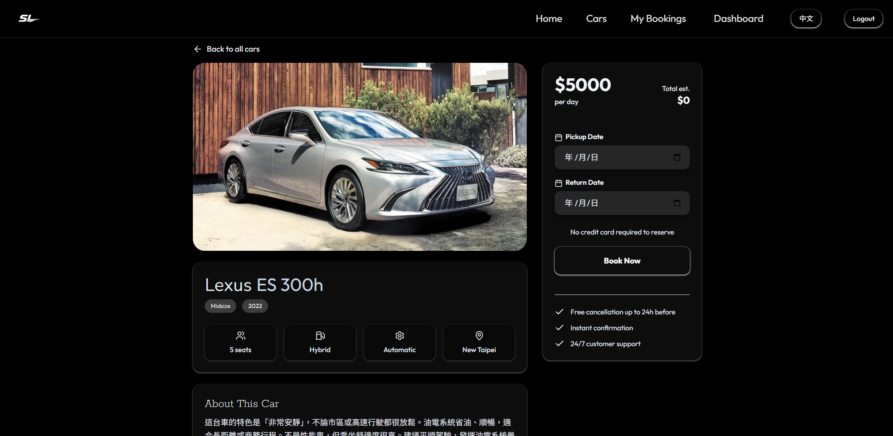
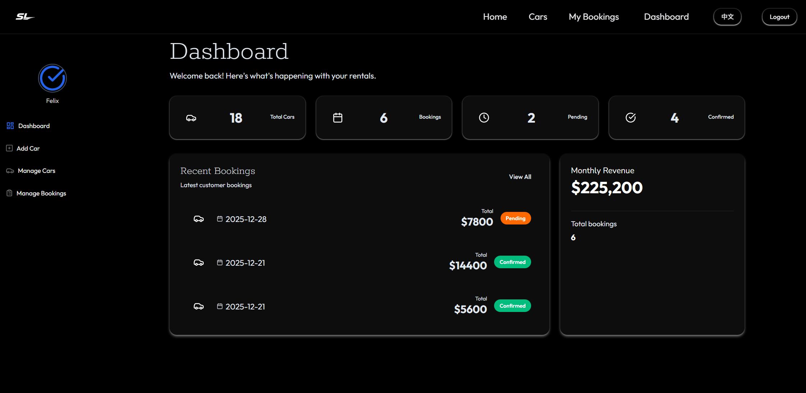
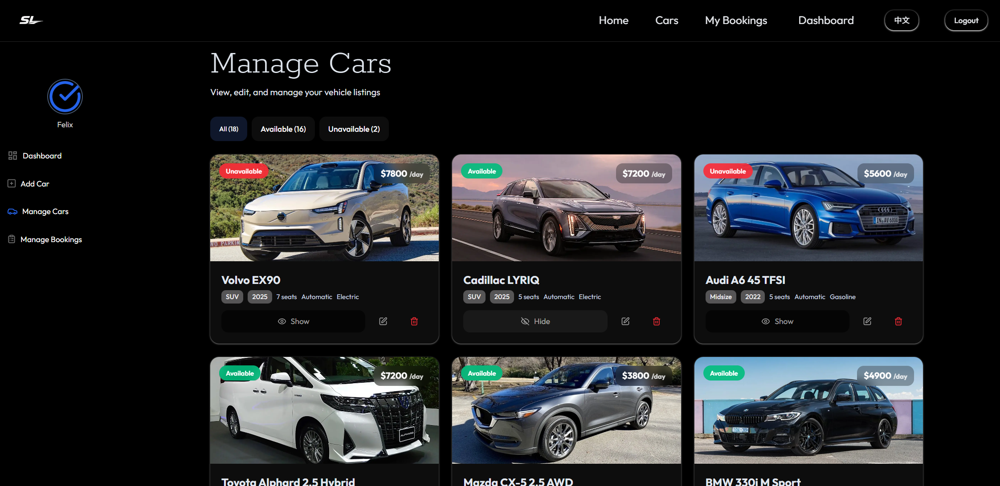

# ShiftLab｜全端汽車租賃平台

ShiftLab 是一個全端練習專案，模擬汽車租賃平台的基本流程。  
使用者可以註冊帳號、瀏覽、管理及刊登車輛、選擇取車與還車日期與地點，並透過查詢條件進行搜尋。

本專案採用 **前後端分離架構**，前端使用 React，後端使用 Node.js / Express，資料庫使用MongoDB 並完成實際部署。

---
## 專案畫面截圖

### 首頁

### 搜尋頁面

### 車輛詳情頁面

### 管理中心主頁

### 車輛管理頁面

---

## Demo 連結

前端 Demo（Vercel）  
  https://car-rental-lemon-one.vercel.app/

---

## 專案背景與目的

- 建立完整的前後端分離專案
- 使用 React 處理表單、狀態與查詢參數
- 串接後端 API 並處理實際使用情境
- 完成專案部署並解決部署後的實務問題（例如路由、環境變數、裝置差異）

同時也可以練習實際產品中"搜尋型功能"與"日期選擇"等常見需求。

---

## 使用者情境

使用者可以：

1. 創建或登錄帳號
2. 選擇取車地點、取車日期與還車日期
3. 透過搜尋條件瀏覽可用車輛
4. 管理車輛或刊登車輛
5. 查看訂單或修改訂單狀態
6. 在不同裝置（桌機 / 手機）上正常使用介面

---

## 技術架構

### 前端（Client）
- React
- Vite
- Tailwind CSS
- React Router
- Context API
- i18n（多語系基礎架構）

### 後端（Server）
- Node.js
- Express
- REST API
- MongoDB
- imageKit

---

