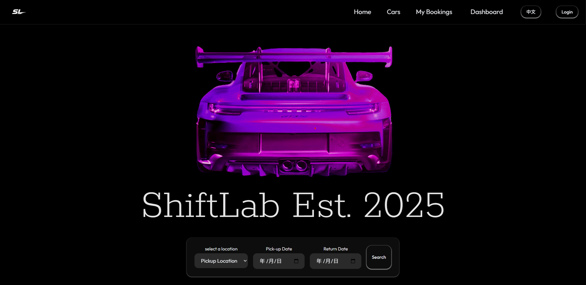
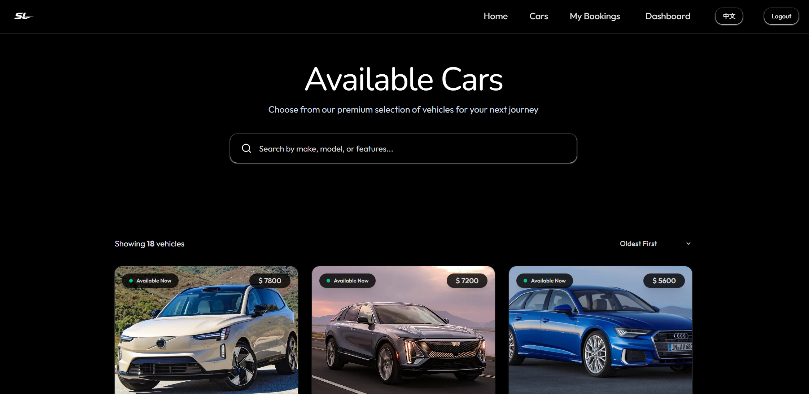
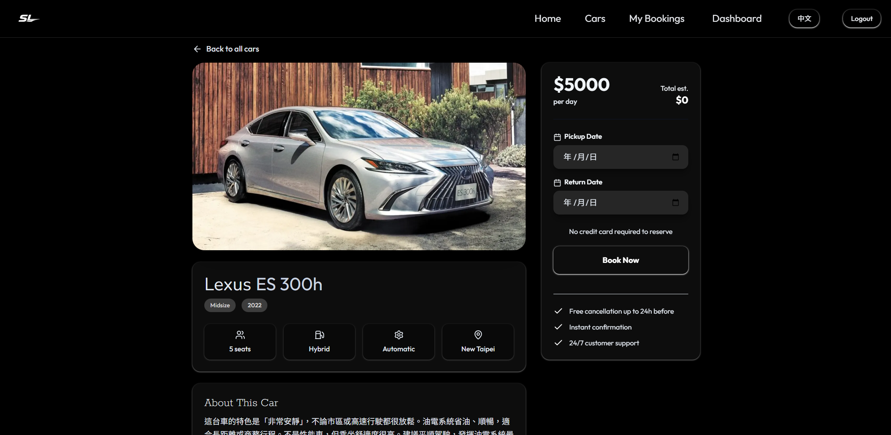
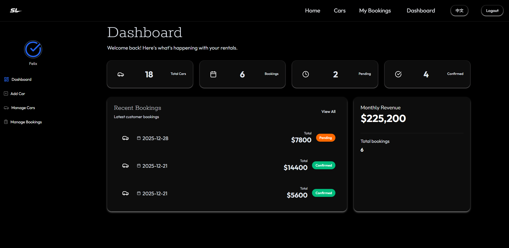
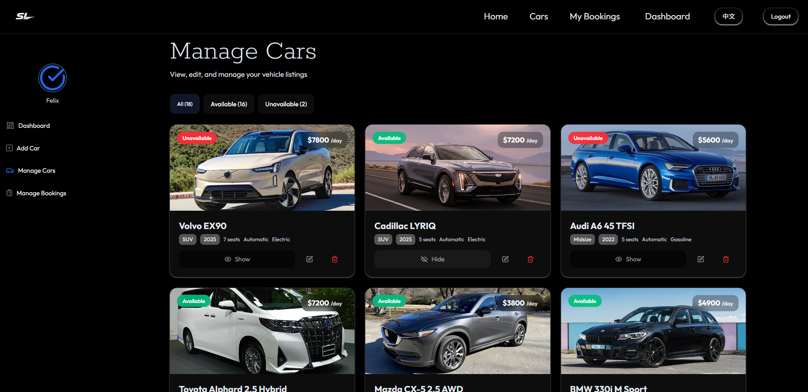

# ShiftLab｜全端汽車租賃平台

ShiftLab 是一個全端汽車租賃平台作品集專案，模擬使用者租車與車主刊登車輛的基本流程。專案採用前後端分離架構，前端負責使用者介面、狀態管理與互動流程，後端負責 API、身份驗證、車輛資料、預約紀錄與圖片上傳。

本專案目前已完成從原生 JavaScript React 專案到 TypeScript 化與資料流整理的重構，並持續補強租車情境中的業務邏輯，例如預約日期檢查、預約狀態管理、使用者取消預約與車主後台統計資料。

---

## Demo 連結

前端 Demo（Vercel）  
https://car-rental-lemon-one.vercel.app/

---

## 專案畫面截圖

### 首頁


### 搜尋頁面


### 車輛詳情頁面


### 管理中心主頁


### 車輛管理頁面


---

## 專案定位

這是一個作品集展示專案，目標不是實作大型商業租車平台的完整功能，而是聚焦在全端開發中最常見也最重要的能力：

- 前後端分離架構設計
- REST API 串接與資料流管理
- 使用者登入與權限控管
- 表單處理與資料驗證
- 查詢條件、日期區間與預約邏輯
- 後台管理介面
- 圖片上傳與第三方服務整合
- 部署環境與環境變數設定

---

## 主要功能

### 一般使用者

- 註冊與登入帳號
- 瀏覽可租用車輛
- 依地點、日期與關鍵字搜尋車輛
- 查看車輛詳細資訊
- 選擇取車與還車日期
- 建立租車預約
- 查看個人預約紀錄
- 取消符合條件的預約

### 車主 / 管理者

- 切換為車主身份
- 新增車輛刊登
- 上傳車輛圖片
- 編輯車輛資料
- 管理車輛上下架狀態
- 查看所有車主預約
- 確認或取消預約
- 查看 Dashboard 統計資料

### 預約與業務邏輯

- 檢查取車日期不可早於今日
- 檢查還車日期不可早於取車日期
- 避免同一台車在重疊日期被重複預約
- 預約狀態包含 pending、confirmed、cancelled
- 已取消的預約不可再次修改
- 已過取車日的 confirmed 預約不可取消
- Dashboard 統計本月 confirmed 預約收入

---

## 技術架構

### 前端 Client

- React
- TypeScript
- Vite
- Tailwind CSS
- React Router
- Context API
- TanStack Query
- Axios
- i18n 多語系基礎架構
- React Hot Toast

### 後端 Server

- Node.js
- Express
- MongoDB
- Mongoose
- JWT Authentication
- Bcrypt
- Multer
- ImageKit
- RESTful API

## 專案結構
```text
carRental
├── client
│   ├── src
│   │   ├── api          # 統一管理與後端對接的 API Layer
│   │   ├── assets       # 靜態資源（圖片、圖示等）
│   │   ├── components   # 共用 UI 元件
│   │   ├── context      # 全域輕量前端狀態 (Client State)
│   │   ├── forms        # 車輛與預約相關表單組件
│   │   ├── locals       # 語系或在地化配置
│   │   ├── pages        # 頁面級別元件
│   │   ├── queries      # TanStack Query (useQuery/useMutation) 封裝
│   │   ├── screenShots  # 專案畫面截圖
│   │   └── types        # TypeScript 型別定義檔 (*.ts)
│   └── package.json
│
├── server
│   ├── configs          # 資料庫與第三方服務配置
│   ├── controllers      # 主要業務邏輯控制器
│   ├── middleware       # 權限驗證與錯誤處理中間件
│   ├── models           # MongoDB 資料模型 (Mongoose Schemas)
│   ├── routes           # API Express 路由定義
│   ├── server.js        # 後端進入點
│   └── package.json
│
└── README.md
```

## 資料模型概念
### User
用於保存會員基本資料與身份：
name
email
password
role
image

### Car
用於保存車輛刊登資料：
owner
brand
model
image
year
category
seating_capacity
fuel_type
transmission
pricePerDay
location
description
isAvaliable

### Booking
用於保存預約紀錄：
car
user
owner
pickupDate
returnDate
status
price

## API 功能概覽
### User
註冊帳號
登入帳號
取得目前登入使用者資料
取得可租用車輛列表

### Owner
切換為車主
新增車輛
編輯車輛
取得車主車輛列表
切換車輛上下架狀態
移除車輛
取得 Dashboard 統計資料
更新使用者圖片

### Booking
檢查車輛指定日期是否可預約
建立預約
取得使用者預約紀錄
取得車主預約紀錄
變更預約狀態
使用者取消預約

## 重構與優化重點
本專案原先以 JavaScript React 撰寫，後續進行了重構與整理，主要改善方向包含：

將前端逐步整理為 TypeScript 架構
抽離 API 請求邏輯
統一 query key 與資料快取更新流程
整理車輛表單資料結構
強化車主後台新增與編輯車輛流程
改善預約狀態管理邏輯
補上使用者取消預約功能
修正 Dashboard 統計資料的業務含義
保留原有技術棧與整體架構，不做過度設計

## 本機啟動方式
1. 安裝前端依賴
```
cd client
npm install
```
2. 安裝後端依賴
```
cd server
npm install
```
3. 設定環境變數
前端 .env 範例：
```
VITE_BASE_URL=http://localhost:3000
VITE_CURRENCY=$
```
後端 .env 範例：
```
MONGODB_URI=your_mongodb_connection_string
JWT_SECRET=your_jwt_secret
IMAGEKIT_PUBLIC_KEY=your_imagekit_public_key
IMAGEKIT_PRIVATE_KEY=your_imagekit_private_key
IMAGEKIT_URL_ENDPOINT=your_imagekit_url_endpoint
PORT=3000
```
4. 啟動後端
```
cd server
npm run server
```
5. 啟動前端
```
cd client
npm run dev
```
### 部署說明
本專案採前後端分離部署：

前端部署於 Vercel
後端部署於 Render
資料庫使用 MongoDB Atlas
圖片服務使用 ImageKit
部署時需分別設定前後端環境變數。前端的 VITE_BASE_URL 需指向後端 API 網址。

## 開發心得
這個專案的重點不只在畫面呈現，而是完整串起一個租車平台會遇到的基本流程：使用者登入、車輛瀏覽、條件搜尋、日期選擇、建立預約、車主審核與後台管理。

在重構過程中，也特別保留原本的技術棧與架構，不刻意導入過重的工程設計，而是針對作品集專案最有展示價值的部分進行補強，讓專案在維持可讀性與可維護性的同時，也具備更完整的產品邏輯。
